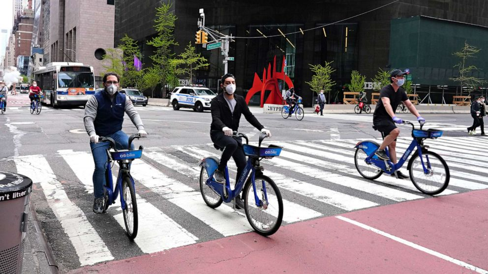
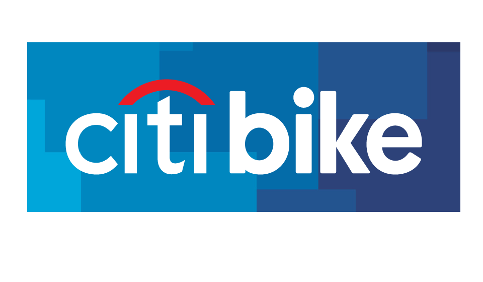
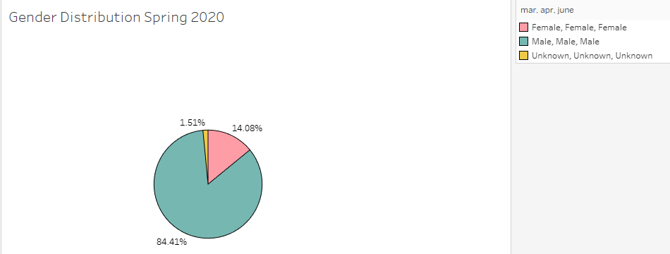

# CityBike Analytics (2020)

  <a href="#data-source">Data Source</a> •
  <a href="#findings">Findings</a> •
  <a href="#technology-Used">Technology Used</a>

Here we are taking a look at the analysis of the CityBike program in NYC, during the 2020 period, using the data provided by the CityBike Data Website. Here we can observe information about the users, the rate of use of the bike service, as well as to see the impact of COVID-19 on the overall CityBike service. We can have some business and cultural insights about the program and the way it has been running during this eventful year. 
 
* Click [here](https://public.tableau.com/profile/duvan8801#!/vizhome/CityBikeAnalytics2020/MapsTrendingStartEnd) to view completed dashboard

## Data Source

This [Citi Bike Data](https://www.citibikenyc.com/system-data) has been processed to remove trips that are taken by staff as they service and inspect the system and any trips that were below 60 seconds in length 
(potentially false starts or users trying to re-dock a bike to ensure it's secure).

<table class="hide-while-loading table table-striped">
<tbody id="tbody-content">
<thead>
<tr>
<th>Name</th>
<th>Date Modified</th>
<th>Size</th>
<th>Type</th>
</tr>
</thead>
<tr>
<td>&nbsp;<a href="https://s3.amazonaws.com/tripdata/202001-citibike-tripdata.csv.zip"> 202001-citibike-tripdata.csv.zip</a></td>
<td>Feb 4th 2020, 01:05:46 pm</td>
<td>53.47 MB</td>
<td>ZIP file</td>
</tr>
<tr>
<td>&nbsp;<a href="https://s3.amazonaws.com/tripdata/202002-citibike-tripdata.csv.zip">202002-citibike-tripdata.csv.zip</a></td>
<td>Mar 24th 2020, 03:07:44 pm</td>
<td>49.51 MB</td>
<td>ZIP file</td>
</tr>
<tr>
<td>&nbsp;<a href="https://s3.amazonaws.com/tripdata/202003-citibike-tripdata.csv.zip">202003-citibike-tripdata.csv.zip</a></td>
<td>Apr 17th 2020, 06:58:01 pm</td>
<td>46.66 MB</td>
<td>ZIP file</td>
</tr>
<tr>
<td>&nbsp;<a href="https://s3.amazonaws.com/tripdata/202004-citibike-tripdata.csv.zip">202004-citibike-tripdata.csv.zip</a></td>
<td>May 26th 2020, 07:18:14 pm</td>
<td>30.12 MB</td>
<td>ZIP file</td>
</tr>
<tr>
<td>&nbsp;<a href="https://s3.amazonaws.com/tripdata/202005-citibike-tripdata.csv.zip"> 202005-citibike-tripdata.csv.zip</a></td>
<td>Jun 5th 2020, 11:09:37 am</td>
<td>65.38 MB</td>
<td>ZIP file</td>
</tr>
<tr>
<td>&nbsp;<a href="https://s3.amazonaws.com/tripdata/202006-citibike-tripdata.csv.zip">202006-citibike-tripdata.csv.zip</a></td>
<td>Jul 5th 2020, 07:37:43 pm</td>
<td>83.40 MB</td>
<td>ZIP file</td>
</tr>
<tr>
<td>&nbsp;<a href="https://s3.amazonaws.com/tripdata/202007-citibike-tripdata.csv.zip">202007-citibike-tripdata.csv.zip</a></td>
<td>Aug 11th 2020, 09:13:25 pm</td>
<td>94.09 MB</td>
<td>ZIP file</td>
</tr>
<tr>
<td>&nbsp;<a href="https://s3.amazonaws.com/tripdata/202008-citibike-tripdata.csv.zip">202008-citibike-tripdata.csv.zip</a></td>
<td>Sep 4th 2020, 02:37:28 pm</td>
<td>104.26 MB</td>
<td>ZIP file</td>
</tr>
</tbody>
</table>

* About a 3% of total users for the 2020 period, did not provide their gender when using the citybike service. A lot of them are one time users and not constant members. Overall we can see that the male customer is dominant when using the CityBike service. 

## Findings 

### (1) The mayority of CityBike users who are constantly using the service, are male dominant with age range of 20-40 years old. The youngest user registered during 2020 was a 16 year old, and the oldest user was a 94 years old. This demonstrates that regardless the season, or events going on in the city/world, everybody seems to enjoy using the CityBike program which is also a healthier mode of transportation. 

 

### (2) Even though there was a big decline at the start of COVID-19 quarantine during MARCH 2020; right at the start of summer people saw CityBike as a better method to get around the city instead of using the subway, and that way, they were able to properly practice social distancing. 

### (3) The peak hours tend to have a small change based on season, but every season has about the same peak hours, just different user traffic. As the temperature gets cold as winter begins, people tend not to ride as well because of the lack of comfort individuals face when riding in low temperatures. Therefore, at some point the ridership does not grow. The most common periods of peak hours are from 7am to 10 am, and the afternoon period which is from 4pm to 8pm. 

### (4) The Bike stations tend to constantly change popularity according to multiple factors, like seasons, weather, weekday/weekend use, events in the area, etc...

## Map visualization for city officials

* Here we can see the stations that tend to be more popular to start and end a ride, amongst all the 5 boroughs, plus some bike stations that are located in Hoboken NJ, where some users decided to end their trip there. 

## Technology Used

